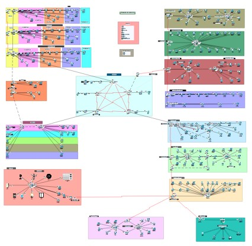

# IT Network Management System

## Overview
This project demonstrates the design and implementation of a robust and scalable network infrastructure for an IT company. The network integrates multiple departments, including Admin Office, Development (3 floors), Cybersecurity (3 floors), NOC, Server Room, HR, IT Support, and Security Camera Rooms, using a hybrid topology.

Key Features:

Routing Protocols: Configured EIGRP, OSPF, and Static routing to ensure optimal path selection, redundancy, and efficient traffic management across 25 routers.

VLANs and Inter-VLAN Routing: Implemented VLANs to segment traffic for Developer (VLAN 10), DevOps (VLAN 20), and Testing (VLAN 30) and Team Mangers (Vlan 40) teams, with inter-VLAN routing and trunking for controlled communication.

Protocols Implemented:
 DHCP, DNS, Telnet, SSH
 VLAN, Inter-VLAN, FHRP, SNMP
 VPN, AAA (TACACS+), NAT, DORA
 Syslog, ACL, IoT

Development Section: Designed a hierarchical network for three floors with specific communication rules between teams.

Tools Used: Cisco Packet Tracer for network simulation and validation of configurations.

This project highlights hands-on expertise in advanced networking concepts, protocols, and tools, demonstrating the ability to design, configure, and simulate enterprise-level networks aligned with CCNA standards. Simulated in Cisco Packet Tracer with 25 routers.

## Topology Diagram

## How to Use
1. Download the project files.
2. Open the `.pkt` file in Cisco Packet Tracer.
3. Explore configurations and test communication.

## Tools Used
- Cisco Packet Tracer
- Protocols: EIGRP, OSPF, Static Routing
